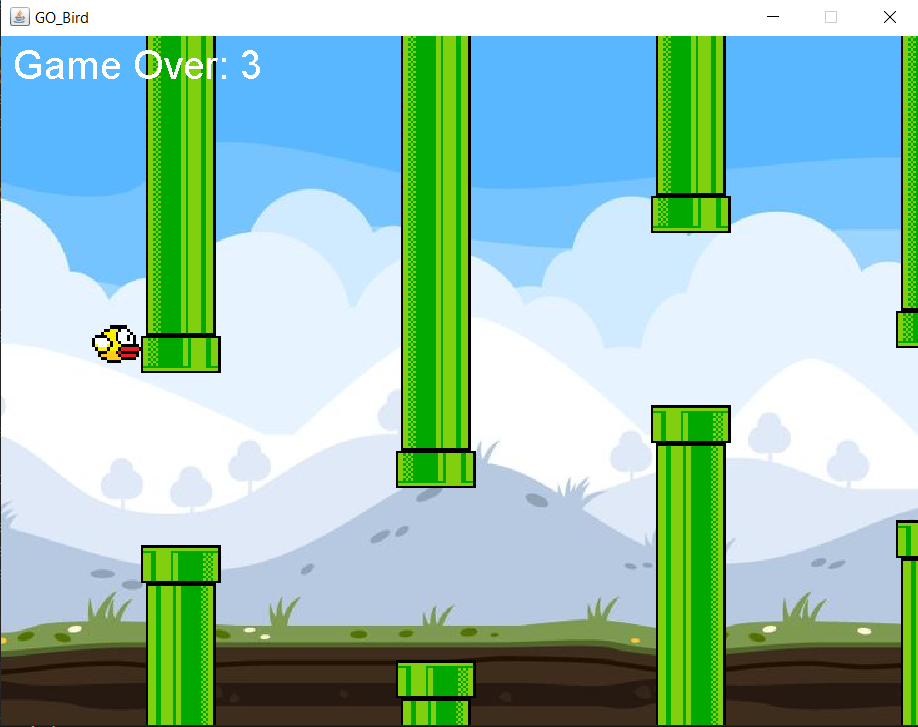

# Welcome to GO_Bird 🐤

Go_Bird is a simple Java-based 2D game. The player controls a bird that flies through randomly generated pipes, trying to avoid collisions and achieve the highest score.


<div align="center">
   
</div>


## Features
- Simple and intuitive gameplay
- Randomly generated pipes with varying heights
- Score system based on successfully passing through pipes
- Restart the game after a loss with a small delay

## Prerequisites
To run Go_Bird, ensure that you have the following installed on your system:
- Java Development Kit (JDK) 8 or later
- Any IDE (e.g., IntelliJ IDEA, Eclipse, NetBeans) or a basic text editor and terminal for compiling

## How to Run the Game

 ### 1. Clone the repository:
   ```
   git clone https://github.com/your_username/Go_Bird.git
   cd Go_Bird
   ```
### 2.  Compile the Java code:
   If you're using an IDE like IntelliJ IDEA or Eclipse, you can directly import the project. Alternatively, compile the project using the terminal:

   ```bash
   javac Go_Bird.java
   ```
### 4.  Run the Game:
   Once compiled, run the game:

   ```
   java Go_Bird
   ```
### 5.  Controls:

   1. Press `SPACE` to make the bird fly. ⬆️
   2. Avoid the pipes! 🏗️
   3. Pass through pipes to increase your score. 🔢
   4. If you hit a pipe or the ground, it’s game over! 😢
   


### 6.  Game Logic
   #### Bird
   The bird's position is controlled by the player using the spacebar. The bird constantly falls due to gravity, and each spacebar press makes the bird jump upward.

   #### Pipes
   Pipes are generated randomly with a small gap in between. The bird needs to fly through the gap to avoid collisions. Pipes move from right to left across the screen.

   #### Game Over
   The game ends if the bird collides with a pipe or falls below the screen. The game can be restarted by pressing the spacebar again.


